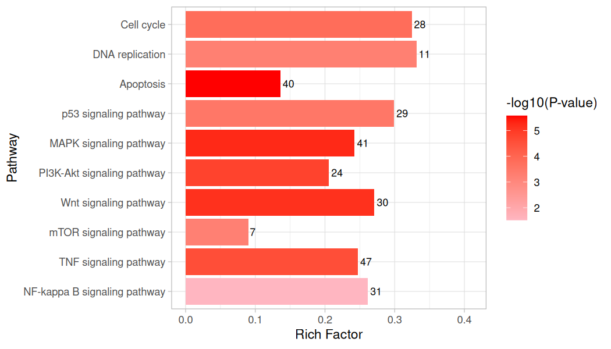
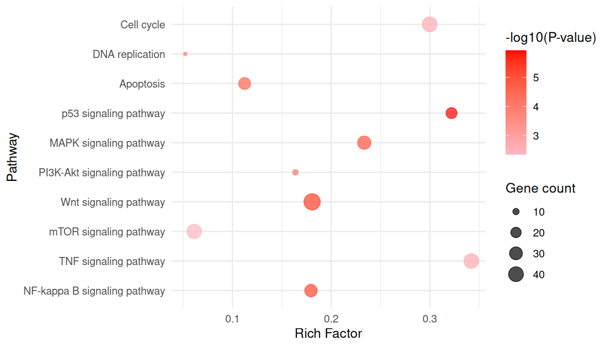
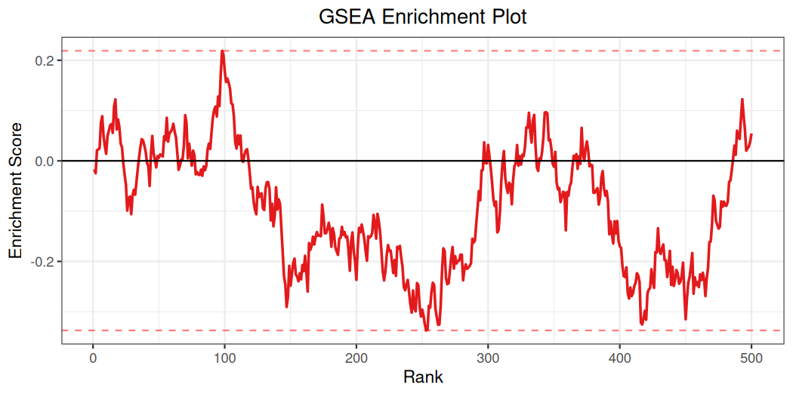
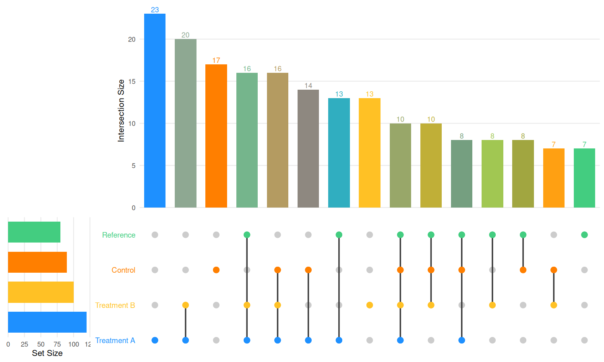
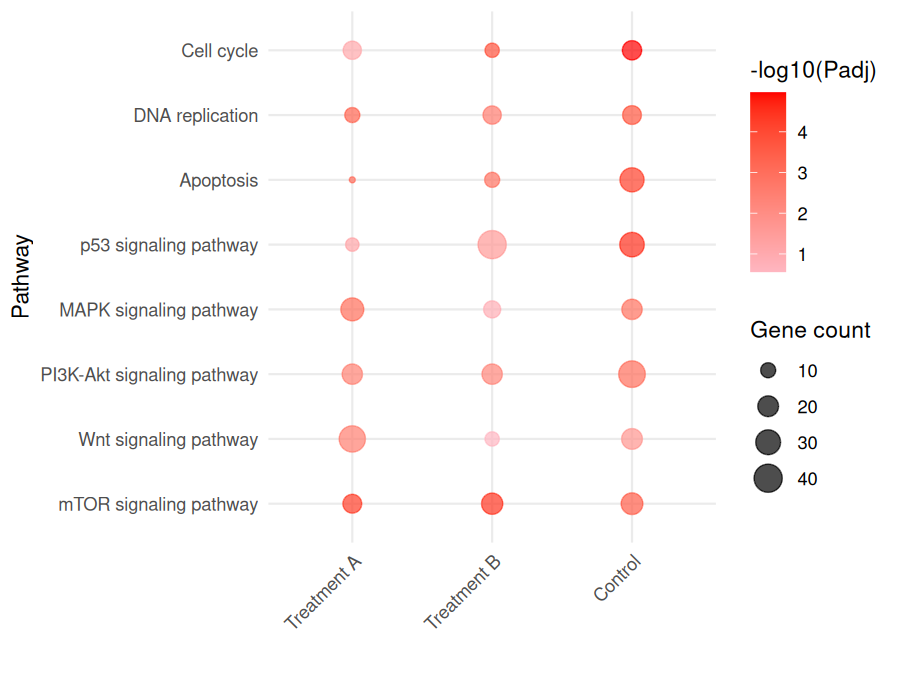

# richR

[](https://www.repostatus.org/#active)
[](https://github.com/hurlab/richR)
[](https://www.gnu.org/licenses/gpl-3.0)
[](https://zenodo.org/badge/latestdoi/243827597)

**Functional Enrichment Analysis and Visualization for R**

richR provides a comprehensive toolkit for functional enrichment analysis, supporting Gene Ontology (GO), KEGG pathways, Reactome, MSigDB, and custom annotation databases. It performs over-representation analysis (ORA), Gene Set Enrichment Analysis (GSEA), and kappa-score-based term clustering, with publication-ready visualizations.

## Features

- **Multiple enrichment methods**: ORA (hypergeometric test), GSEA, and DAVID (online)
- **Broad database support**: GO (BP/MF/CC), KEGG, Reactome, MSigDB (Hallmark, C1-C7), KEGG modules
- **21 built-in species** with Bioconductor annotation packages
- **Term clustering**: Kappa-score-based functional clustering of enrichment results
- **Rich visualizations**: Bar plots, dot plots, network graphs, heatmaps, GSEA enrichment curves, cluster plots
- **Tidyverse integration**: Direct `dplyr` verb support (`filter`, `select`, `mutate`, `group_by`, etc.)
- **Batch GSEA**: Process multiple comparisons with directional (up/down) coloring
- **Flexible output**: Enrichment statistics include Rich Factor, Fold Enrichment, and z-scores

## Installation

### From GitHub (recommended)

```r
# install.packages("devtools")
devtools::install_github("hurlab/richR")
```

### Dependencies

richR requires Bioconductor packages. If not already installed:

```r
if (!requireNamespace("BiocManager", quietly = TRUE))
    install.packages("BiocManager")

BiocManager::install(c("GO.db", "AnnotationDbi", "KEGGREST", "fgsea", "S4Vectors"))

# Species-specific annotation (e.g., human):
BiocManager::install("org.Hs.eg.db")
```

## Quick Start

### 1. Check available species

```r
library(richR)
showData()
#>         species           dbname
#> 1     anopheles     org.Ag.eg.db
#> 2   arabidopsis   org.At.tair.db
#> 3        bovine     org.Bt.eg.db
#> ...
#> 10        human     org.Hs.eg.db
#> 13        mouse     org.Mm.eg.db
#> ...
```

### 2. Build annotation databases

```r
# GO annotation
hsago <- buildAnnot(species = "human", keytype = "SYMBOL", anntype = "GO")

# KEGG pathway annotation
hsako <- buildAnnot(species = "human", keytype = "SYMBOL", anntype = "KEGG")

# Reactome pathways (requires reactome.db)
hsaro <- buildAnnot(species = "human", keytype = "SYMBOL", anntype = "Reactome")

# KEGG modules
hsakom <- buildAnnot(species = "human", keytype = "SYMBOL", anntype = "KEGGM")

# MSigDB gene sets (Hallmark, KEGG, GO, REACTOME, BIOCARTA, etc.)
hsamsi <- buildMSIGDB(species = "human", keytype = "SYMBOL", anntype = "HALLMARK")

# See all MSigDB categories:
msigdbinfo()
```

### 3. Custom gene sets (GMT files or named lists)

```r
# Import from GMT file (MSigDB, Enrichr, etc.)
annot <- readGMT("h.all.v2023.2.Hs.symbols.gmt", species = "human")
res <- enrich(my_genes, annot)

# From a named list of gene vectors
my_sets <- list(
  "Apoptosis" = c("TP53", "BAX", "BCL2", "CASP3"),
  "Cell Cycle" = c("CDK1", "CDK2", "CCND1", "RB1")
)
annot <- buildAnnotFromList(my_sets)
res <- enrich(my_genes, annot)
```

### 4. Custom annotation with bioAnno

```r
# If you have bioAnno installed (https://github.com/guokai8/bioAnno):
# library(bioAnno)
# fromKEGG(species = "ath")
# athgo <- buildOwn(dbname = "org.ath.eg.db", anntype = "GO")
# athko <- buildOwn(dbname = "org.ath.eg.db", anntype = "KEGG")
```

## Over-Representation Analysis (ORA)

### GO Enrichment

```r
# Prepare gene list (e.g., from differential expression analysis)
gene <- c("TP53", "BRCA1", "EGFR", "MYC", "PTEN", "RB1", "AKT1", "KRAS")
# Or use gene IDs from your analysis:
# gene <- rownames(degs)[degs$padj < 0.05]

# GO Biological Process enrichment
resgo <- richGO(gene, godata = hsago, ontology = "BP")

# View top results
head(result(resgo))
#>           Annot                              Term Annotated Significant RichFactor ...
#> GO:0006915 GO:0006915         apoptotic process       718          5     0.0070 ...
#> GO:0008283 GO:0008283          cell proliferation       920          6     0.0065 ...

# View detailed gene-term mapping
head(detail(resgo))
```

### KEGG Pathway Enrichment

```r
resko <- richKEGG(gene, kodata = hsako, pvalue = 0.05)
head(result(resko))

# Gene set size filtering
resko <- richKEGG(gene, kodata = hsako,
                   minGSSize = 10,   # minimum genes in pathway
                   maxGSSize = 500)  # maximum genes in pathway
```

### Generic Enrichment (any annotation)

```r
# Works with any annotation data frame or Annot object
res <- enrich(gene, object = hsago, ontology = "BP")
```

### KEGG Level-based Enrichment

```r
# Enrichment at KEGG pathway hierarchy levels
res_level <- richLevel(gene, kodata = hsako, level = "Level2")
```

## Gene Set Enrichment Analysis (GSEA)

GSEA requires a **ranked gene list** (named numeric vector of log2 fold changes):

```r
# Prepare ranked gene list
set.seed(123)
name <- sample(unique(hsako$GeneID), 1000)
gene_ranks <- rnorm(1000)
names(gene_ranks) <- name

# Run GSEA
res_gsea <- richGSEA(gene_ranks, object = hsako)
head(result(res_gsea))
#>                             pathway   pval    padj   log2err       ES      NES  size ...

# GSEA with KEGG hierarchy information
res_gsea <- richGSEA(gene_ranks, object = hsako, KEGG = TRUE)
```

### GSEA from a data.frame

```r
# If you have a DEG table with log2FC column:
deg_table <- data.frame(
  Gene = name,
  log2FoldChange = gene_ranks
)
rownames(deg_table) <- deg_table$Gene

res_gsea <- parGSEA(deg_table, object = hsako, log2FC = "log2FoldChange")
```

### GSEA Pathway Utilities

```r
# Get significant pathways
sig_paths <- getPathways(res_gsea, padj_cutoff = 0.05)

# Search pathways by keyword
mapk_paths <- searchPathways(res_gsea, "MAPK")

# Filter by multiple criteria
filtered <- filterPathways(res_gsea,
                            nes_cutoff = 1.5,
                            padj_cutoff = 0.01,
                            direction = "up")  # "up", "down", or "both"

# Get summary statistics
stats <- getPathwayStats(res_gsea, top = 20)
```

## Visualization

### Bar Plot

```r
ggbar(resgo, top = 20, usePadj = FALSE)
ggbar(resgo, top = 20, order = TRUE, horiz = TRUE)
```



### Dot Plot

```r
ggdot(resko, top = 15, usePadj = TRUE)
ggdot(resko, top = 15, order = TRUE, low = "blue", high = "red")
```



### GSEA Enrichment Plot

```r
# Table view of top pathways
ggGSEA(term = res_gsea$pathway, object = hsako, gseaRes = res_gsea, default = TRUE)

# Individual enrichment curves
ggGSEA(term = res_gsea$pathway, object = hsako, gseaRes = res_gsea,
        top = 10, default = FALSE)

# Enhanced multi-pathway plot with directional coloring
plotGSEA(object = hsako, gseaRes = res_gsea, show_direction = TRUE)

# Plot specific pathways
plotGSEA(object = hsako, gseaRes = res_gsea,
         pathways = c("MAPK signaling pathway", "PI3K-Akt signaling pathway"))

# Search and plot by pattern
plotGSEA(object = hsako, gseaRes = res_gsea, pathway_pattern = "signaling")

# Save with optimal dimensions
p <- plotGSEA(object = hsako, gseaRes = res_gsea)
saveGSEAplot(p, "gsea_plot.pdf")
```



### Network Plots

```r
# Gene-term network
ggnetplot(resko, top = 20)

# Term similarity network
ggnetwork(resgo, top = 20, weightcut = 0.01)
```

### Heatmap

```r
# Enrichment heatmap (from ggnetmap)
ggnetmap(list(resgo, resko), top = 50, visNet = TRUE, smooth = FALSE)
```

## UpSet Plot (Set Intersection Visualization)

The `ggupset()` function creates color-enhanced UpSet plots for visualizing set
intersections across multiple gene lists. Built entirely with ggplot2, it does
not require the UpSetR package.

```r
# From gene lists (reproduces the figure below)
set.seed(123)
genes <- paste0("Gene", 1:250)
gene_lists <- list(
  "Treatment A" = sample(genes, 150),
  "Treatment B" = sample(genes, 130),
  "Control"     = sample(genes, 110),
  "Reference"   = sample(genes, 100)
)
ggupset(gene_lists, mycol = c("dodgerblue", "goldenrod1", "darkorange1", "seagreen3"))

# From enrichment results
res1 <- richKEGG(gene1, kodata = hsako)
res2 <- richKEGG(gene2, kodata = hsako)
ggupset(list("Sample1" = res1, "Sample2" = res2))

# Ordering and filtering
ggupset(gene_lists, order.by = "degree", nintersects = 20)

# Save to file
ggupset(gene_lists, filename = "upset_plot.pdf", width = 10, height = 6)
```



**Key features:**
- Per-set colors for bars, matrix dots, and set labels
- Single-set bars use the set color; multi-set intersection bars use a blend of the participating set colors
- Order by frequency or degree (number of sets in intersection)
- Accepts gene lists, richResult objects, or GSEAResult objects
- No dependency on the UpSetR package

## Comparing Multiple Groups

### ORA Comparison

```r
gene1 <- sample(unique(hsako$GeneID), 1000)
gene2 <- sample(unique(hsako$GeneID), 1000)
resko1 <- richKEGG(gene1, kodata = hsako)
resko2 <- richKEGG(gene2, kodata = hsako)

# Combine results
res_compare <- compareResult(list(Treatment = resko1, Control = resko2))
comparedot(res_compare, pvalue = 0.05)

# Filter by KEGG pathway level
comparedot(res_compare, level = "Level2", pathway = c("Signal transduction"))
```



### GSEA Comparison

```r
fc1 <- rnorm(1000)
names(fc1) <- gene1
fc2 <- rnorm(1000)
names(fc2) <- gene2

gsea1 <- richGSEA(fc1, object = hsako)
gsea2 <- richGSEA(fc2, object = hsako)

# Faceted GSEA comparison
compareGSEA(list(S1 = gsea1, S2 = gsea2), object = hsako)

# Batch GSEA with auto-saved figures
plots <- batchGSEAplot(
  list("TreatmentA" = gsea1, "TreatmentB" = gsea2),
  object = hsako,
  output_dir = "gsea_plots"
)
```

## Kappa-Score Term Clustering

```r
# Cluster related GO terms
resc <- richCluster(resgo, cutoff = 0.5, minSize = 5, escore = 3)
head(resc)
#>   AnnotationCluster EnrichmentScore filteredClusterSize ...

# Visualize clusters
ggdot(resc)
```

### KEGG Cluster Visualization

```r
# Requires KEGG Level data (from richLevel or richKEGG with KEGG=TRUE)
ggcluster(data, method = "enrich")   # ORA results
ggcluster(data, method = "gsea")     # GSEA results
```

## DAVID Analysis (Online)

```r
gene <- sample(unique(hsako$GeneID), 1000)
res_david <- richDAVID(gene, keytype = "ENTREZID", species = "human",
                        anntype = "GOTERM_BP_FAT")
```

> **Note:** DAVID analysis requires internet access and the `RDAVIDWebService` package.

## Tidyverse Integration

richR objects directly support `dplyr` verbs:

```r
library(dplyr)

# Filter results
filter(resko, Padj < 0.01) %>% head()

# Select columns
select(resko, Term, Pvalue, Padj)

# Chain operations
resko %>%
  filter(Padj < 0.05) %>%
  arrange(Pvalue) %>%
  head(10)
```

## Supported Species

| Common Name   | KEGG Code | Annotation Package  |
|---------------|-----------|---------------------|
| human         | hsa       | org.Hs.eg.db        |
| mouse         | mmu       | org.Mm.eg.db        |
| rat           | rno       | org.Rn.eg.db        |
| zebrafish     | dre       | org.Dr.eg.db        |
| fly           | dme       | org.Dm.eg.db        |
| yeast         | sce       | org.Sc.sgd.db       |
| arabidopsis   | ath       | org.At.tair.db      |
| chicken       | gga       | org.Gg.eg.db        |
| bovine        | bta       | org.Bt.eg.db        |
| pig           | ssc       | org.Ss.eg.db        |
| celegans      | cel       | org.Ce.eg.db        |

Run `showData()` for the full list of 21 supported species.

## Citation

If you use richR in your research, please cite:

> Guo K, Hur J (2025). richR: Functional Enrichment Analysis and Visualization. R package version 0.1.0. https://github.com/hurlab/richR

## Contact

- **Kai Guo** (original author): guokai8@gmail.com
- **Junguk Hur** (maintainer): junguk.hur@med.und.edu
- **Issues**: https://github.com/hurlab/richR/issues
